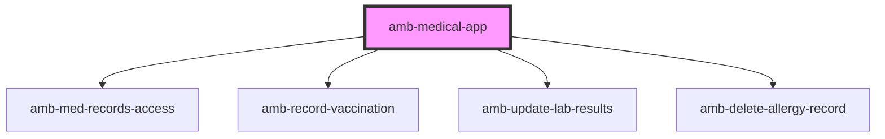

# amb-medical-app

<!-- Auto Generated Below -->

## Properties

| Property   | Attribute   | Description | Type     | Default |
| ---------- | ----------- | ----------- | -------- | ------- |
| `basePath` | `base-path` |             | `string` | `''`    |

## Dependencies

### Depends on

- [amb-med-records-access](../amb-med-records-access)
- [amb-record-vaccination](../amb-record-vaccination)
- [amb-update-lab-results](../amb-update-lab-results)
- [amb-delete-allergy-record](../amb-delete-allergy-record)

### Graph

----------------------------------------------

*Built with [StencilJS](https://stenciljs.com/)*
