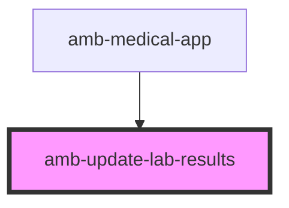

# amb-update-lab-results

<!-- Auto Generated Below -->

## Properties

| Property   | Attribute   | Description | Type     | Default     |
| ---------- | ----------- | ----------- | -------- | ----------- |
| `recordId` | `record-id` |             | `string` | `undefined` |

## Dependencies

### Used by

 - [amb-medical-app](../amb-medical-app)

### Graph

----------------------------------------------

*Built with [StencilJS](https://stenciljs.com/)*
